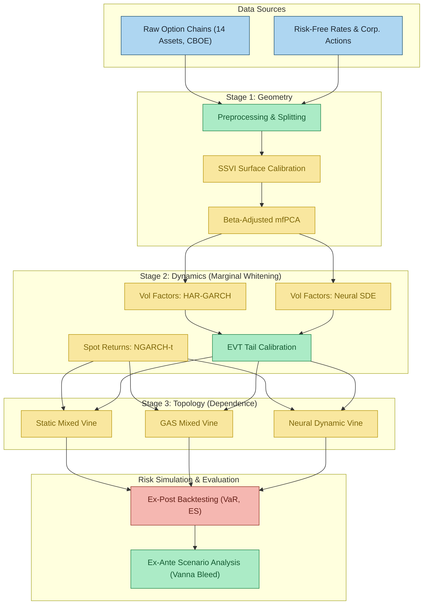

# Leverage and Contagion Effects in Implied Volatility Surfaces: A Mixed Neural Vine Copula Approach
_Project by Luca Leimbeck Del Duca | **Partner Firm:** Optiver_


## Abstract 
Forecasting the joint evolution of implied volatility surfaces across a high-dimensional universe of assets is a critical challenge for market makers, particularly during periods of systemic stress. Traditional econometric models often struggle to reconcile the arbitrage-free geometry of the surface with the complex, non-linear dependence structure of asset returns. This paper proposes a unified deep generative framework that decomposes the joint forecasting problem into three sequential stages: geometry, dynamics, and topology. 

First, the surface stochastic volatility inspired (SSVI) parameterization and beta-adjusted multilevel functional principal component analysis ($\beta^{adj}$-mfPCA) are employed to construct an arbitrage-free, low-dimensional market representation. Second, the temporal evolution of the extracted factors is modeled using neural stochastic differential equations (NSDE), which capture path-dependent memory structures without imposing the rigid parametric constraints of standard linear benchmarks. Finally, the high-dimensional, asymmetric dependence structure is estimated via a novel differentiable mixed regular vine copula. Evaluating this framework across a diverse panel of 14 assets reveals that the dynamic neural topology significantly outperforms benchmarks in capturing asymmetric tail dependence and passing strict conditional coverage criteria. Furthermore, ex-ante delta-hedging simulations accurately isolate the systematic vanna bleed, proving the economic value of correctly specifying high-dimensional market contagion.

## Repository Architecture

The codebase is modularized to strictly mirror the methodological stages detailed in the research framework.

```text
├── config/                         # Global project configuration
│   ├── assets.json                 # Panel definitions (14 CBOE assets)
│   └── settings.py                 # Hyperparameters and path management
├── data/                           # Data storage (git-ignored)
│   └── results/                    # Persisted artifacts (backtests, copulas, factors)
├── src/                            # Core model pipeline
│   ├── preprocessing/              # Option chain filtering, arbitrage checks, and rate construction
│   ├── fitting/                    # SSVI calibration engine via Differential Evolution & SLSQP
│   ├── compression/                # Beta-adjusted multilevel functional PCA (β^adj-mfPCA)
│   ├── dynamics/                   # Marginal filtration (NGARCH-t, HAR-GARCH, NSDE, EVT tail modeling)
│   ├── dependence/                 # Topological networks (Static, GAS, and Neural Dynamic Vines)
│   ├── backtesting/                # Ex-post VaR/ES and ex-ante vanna bleed hedging simulations
│   └── intermediate_diagnostics/   # Pipeline validation and diagnostic logging
├── main.py                         # Primary execution entry point
├── pyproject.toml                  # Project metadata and dependencies
└── uv.lock                         # Strict deterministic dependency locking
```

## Methodology Flowchart


